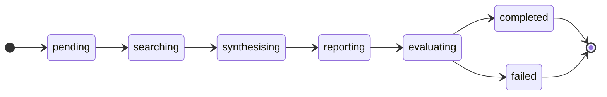

## How it works

Each research job passes through four sequential agents:


| Agent | What it does |
|---|---|
| **Search** | Generates queries, fetches web sources, extracts structured evidence |
| **Synthesis** | Groups evidence into themes, detects contradictions |
| **Report** | Writes a structured, cited Markdown report (~2 000 words) |
| **Evaluator** | Scores on coverage, faithfulness, hallucination rate, and usefulness |

Jobs run in the background. All intermediate state is persisted in SQLite. The frontend polls for updates and renders live progress via Server-Sent Events.



---

## Folder structure

```
ml-ess/
├── api/                        # Python backend
│   ├── main.py                 # Uvicorn entry point & CLI
│   ├── requirements.txt
│   ├── app/
│   │   ├── agents/
│   │   │   ├── search.py       # Stage 1 — query, fetch, extract evidence
│   │   │   ├── synthesis.py    # Stage 2 — themes & contradictions
│   │   │   ├── report.py       # Stage 3 — outline + full report
│   │   │   └── evaluator.py    # Stage 4 — quality scores
│   │   ├── core/
│   │   │   ├── pipeline.py     # Orchestrates the four agents
│   │   │   ├── llm.py          # chat() / chat_json() + Groq→HF fallback
│   │   │   ├── jobs.py         # Job manager, SSE event emitter
│   │   │   └── store.py        # SQLite WAL persistence
│   │   ├── api/
│   │   │   ├── routes.py       # FastAPI endpoints
│   │   │   ├── auth.py         # X-API-Key middleware
│   │   │   └── webhook.py      # Telegram / WhatsApp webhooks
│   │   └── models/
│   │       ├── state.py        # SharedState + sub-models (Pydantic v2)
│   │       └── api.py          # Request / response schemas
│   └── tests/
│       ├── test_agents.py
│       └── test_api.py
├── frontend/                   # Next.js 16 web UI
│   ├── app/                    # App Router pages & layouts
│   ├── components/             # ResearchForm, JobStatus, ReportView, …
│   ├── hooks/
│   │   └── useSSE.ts           # Server-Sent Events subscription hook
│   └── lib/
│       └── api.ts              # Typed fetch client
└── ressources/
    ├── report/latex/           # LaTeX technical report
    ├── slides/                 # Beamer presentation
    └── notebook/               # Jupyter walkthroughs
```

---

## Stack

| Layer | Technology |
|---|---|
| Backend | Python 3.11+, FastAPI, Uvicorn |
| LLM (primary) | Groq API — `llama-3.3-70b-versatile` |
| LLM (fallback) | HuggingFace Inference — `Llama-3.3-70B-Instruct` |
| Web search | DuckDuckGo (default) + Tavily (optional) |
| Web scraping | httpx + BeautifulSoup4 |
| Validation | Pydantic v2 |
| Database | SQLite (WAL mode) |
| PDF export | WeasyPrint |
| Frontend | Next.js 16, React 19, TypeScript, Tailwind CSS v4 |

| Hosting (BE) | Render — Python/FastAPI service |

---


### Backend

```bash
cd api
python -m venv venv
source venv/bin/activate      # Windows: venv\Scripts\activate
pip install -r requirements.txt

cp ../.env.example .env       # then edit .env with your keys
```

### Frontend

```bash
cd frontend
npm install
```

Create `frontend/.env.local`:

```env
NEXT_PUBLIC_API_URL=http://localhost:8000
NEXT_PUBLIC_API_KEY=your-api-key   # same value as API_KEY in api/.env
```

---

## Running

**API server** (port 8000):
```bash
cd api
source venv/bin/activate
python main.py serve

# dev mode with auto-reload:
python main.py serve --reload
```

**Frontend** (port 3000):
```bash
cd frontend
npm run dev
```

**CLI** (single question, no server needed):
```bash
cd api
python main.py research "What are the trade-offs between CNNs and Vision Transformers?"
```

---

## Environment variables

Copy `.env.example` to `api/.env` and fill in the values.

| Variable | Default | Description |
|---|---|---|
| `LLM_PROVIDER` | `auto` | `groq`, `huggingface`, or `auto` (tries Groq first) |
| `GROQ_API_KEY` | — | Primary Groq API key |
| `GROQ_API_KEY_2` | — | Secondary Groq key (extends rate-limit headroom) |
| `GROQ_MODEL` | `llama-3.3-70b-versatile` | Groq model ID |
| `HF_TOKEN` | — | HuggingFace API token |
| `HF_MODEL` | `meta-llama/Llama-3.3-70B-Instruct` | HuggingFace model ID |
| `TEMPERATURE` | `0.3` | LLM sampling temperature |
| `TAVILY_API_KEY` | — | Tavily search key (optional, falls back to DuckDuckGo) |
| `MAX_SEARCH_QUERIES` | `3` | Search queries generated per job |
| `MAX_RESULTS_PER_QUERY` | `5` | Web results fetched per query |
| `MAX_CONTENT_LENGTH` | `3000` | Max characters scraped per page |
| `API_KEY` | — | Static key for `X-API-Key` auth (leave empty to disable in dev) |
| `API_HOST` | `0.0.0.0` | Bind address |
| `API_PORT` | `8000` | Bind port |
| `DB_PATH` | `data/jobs.db` | SQLite file path (relative to `api/`) |
| `CORS_ORIGINS` | `http://localhost:3000` | Comma-separated allowed origins |

Generate a strong `API_KEY`:
```bash
python -c "import secrets; print(secrets.token_hex(32))"
```

Optional WhatsApp integration: `WHATSAPP_TOKEN`, `WHATSAPP_PHONE_ID`, `WHATSAPP_VERIFY_TOKEN`, `WEBHOOK_SECRET`.

---

## API reference

All `/api/research/*` endpoints require `X-API-Key: <your-key>` if `API_KEY` is set.

| Method | Endpoint | Description |
|---|---|---|
| `POST` | `/api/research` | Submit a question — returns `job_id` immediately (202) |
| `GET` | `/api/research` | List all jobs |
| `GET` | `/api/research/{id}` | Job status, report, and evaluation scores |
| `GET` | `/api/research/{id}/reasoning` | Detailed reasoning steps (queries, sources, themes…) |
| `GET` | `/api/research/{id}/events` | SSE stream of live progress |
| `GET` | `/api/research/{id}/pdf` | Download report as PDF |
| `DELETE` | `/api/research/{id}` | Delete a job |
| `DELETE` | `/api/research` | Clear all jobs |
| `GET` | `/api/health` | Health check (no auth required) |

**Example — submit a job:**
```bash
curl -X POST http://localhost:8000/api/research \
  -H "Content-Type: application/json" \
  -H "X-API-Key: your-key" \
  -d '{"question": "What are the opportunities and risks of adopting AI in healthcare?"}'
```

---

## Telegram bot

The bot exposes the full research pipeline via chat.

1. Send any research question to the bot
2. It acknowledges, starts a background job, and sends progress updates at each pipeline stage
3. The final report is delivered as chunked messages with quality scores

Set the following env vars in `api/.env`:

| Variable | Description |
|---|---|
| `TELEGRAM_BOT_TOKEN` | Token from [@BotFather](https://t.me/BotFather) |
| `WEBHOOK_SECRET` | Optional secret for webhook validation |

Register the webhook once the backend is live:
```bash
curl "https://api.telegram.org/bot<TOKEN>/setWebhook?url=https://<your-render-url>/api/webhook/telegram"
```

---

## Deployment

| Service | Platform | URL |
|---|---|---|
| Frontend | Vercel | [research-agent-phi-six.vercel.app](https://research-agent-phi-six.vercel.app) |
| Backend API | Render | your Render service URL |

Set all required environment variables in each platform's dashboard (same variables as `api/.env`). The frontend needs `NEXT_PUBLIC_API_URL` pointing to the Render service URL and `NEXT_PUBLIC_API_KEY` matching the backend `API_KEY`.

---

## Tests

```bash
cd api
pytest tests/
```

---

## Technical report

A full technical report (system architecture, agent pipeline, design decisions, limitations) is available as a two-column LaTeX PDF:

```
ressources/report/latex/report.pdf
```

---

## Extending the pipeline

ML-ESS is designed for incremental extension. To add a new research stage:

1. Create a new agent function in `api/app/agents/`.
2. Add the corresponding fields to `SharedState` in `api/app/models/state.py`.
3. Insert the agent call in `api/app/core/pipeline.py`.

The REST API and frontend will automatically expose the new state without further changes.

---

## Project context

This prototype was built and demonstrated during the **AIMS Research Innovation Centre Doctoral Training School 2026**. It prioritises clarity and modularity over production hardening — every component is inspectable and the pipeline can be traced end-to-end from a single research question to a scored report.
