# AIMS RIC - Doctoral Training School:Multi-Agent AI Research Assistant
### Technical Report — April 2026


## Abstract

ML-ESS is a full-stack AI system that automates end-to-end research: given a natural language question, it orchestrates four specialized AI agents to search the web, synthesize evidence, draft a structured report, and evaluate the report's quality. The system exposes a REST API (FastAPI) and a modern web interface (Next.js), supporting real-time progress tracking, PDF export, and multi-provider LLM fallback.

---

## 1. Introduction & Motivation

Conducting thorough research manually is time-consuming: it involves querying multiple sources, extracting relevant claims, resolving contradictions, and composing a coherent, well-cited document. ML-ESS automates this entire workflow through a multi-agent pipeline, replacing hours of manual work with a structured, reproducible process.

**Core objectives:**

- Accept any research question in natural language
- Autonomously gather evidence from the open web
- Synthesize findings into themes, resolving contradictions
- Generate a structured Markdown report with citations and diagrams
- Score the report's quality along four dimensions
- Deliver everything through a clean web UI with real-time feedback

---

## 2. System Architecture

### 2.1 High-Level Overview

The system is divided into two main services: a Python backend responsible for all AI reasoning and data persistence, and a Next.js frontend that provides the user interface.

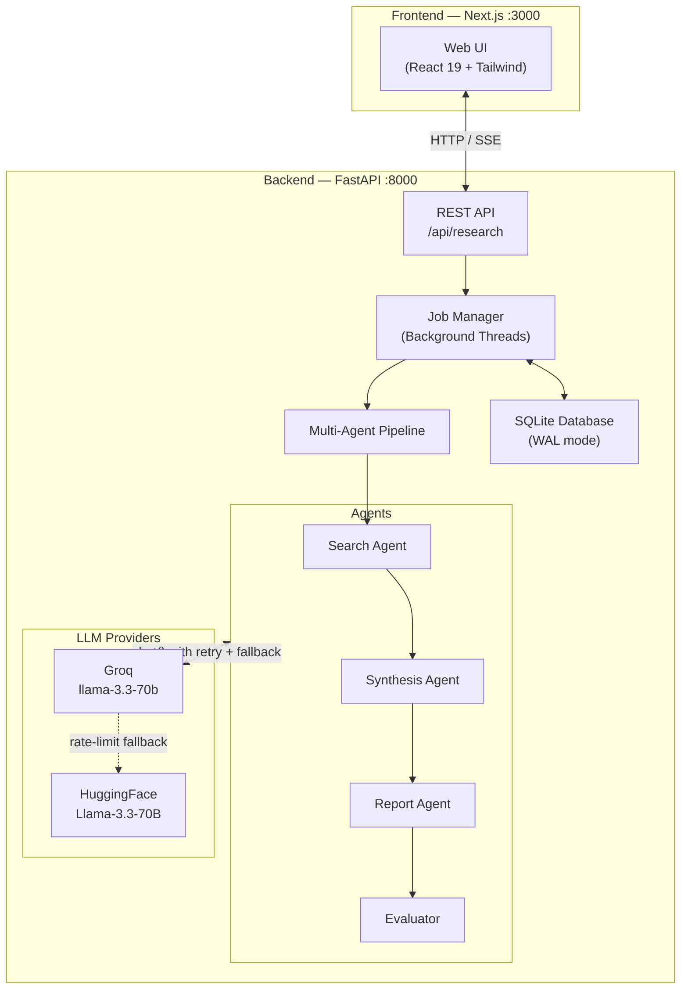

### 2.2 Backend Directory Structure

```
api/
├── main.py                  ← CLI & server entry point
├── app/
│   ├── agents/
│   │   ├── search.py        ← Web search & evidence extraction
│   │   ├── synthesis.py     ← Theme identification & contradiction detection
│   │   ├── report.py        ← Outline creation & Markdown generation
│   │   └── evaluator.py     ← Quality scoring
│   ├── api/
│   │   ├── app.py           ← FastAPI app factory, CORS, routers
│   │   ├── routes.py        ← REST endpoints & SSE streaming
│   │   ├── auth.py          ← API key authentication
│   │   └── webhook.py       ← WhatsApp integration (optional)
│   ├── core/
│   │   ├── pipeline.py      ← Sequential agent orchestration
│   │   ├── jobs.py          ← Background thread management & caching
│   │   ├── store.py         ← SQLite persistence (WAL mode)
│   │   ├── llm.py           ← LLM client with retries & fallback
│   │   └── config.py        ← Environment variable loading
│   └── models/
│       ├── api.py           ← Request/response Pydantic schemas
│       └── state.py         ← Pipeline shared state schema
└── tests/                   ← Pytest test suite
```

### 2.3 Request Lifecycle & Data Flow

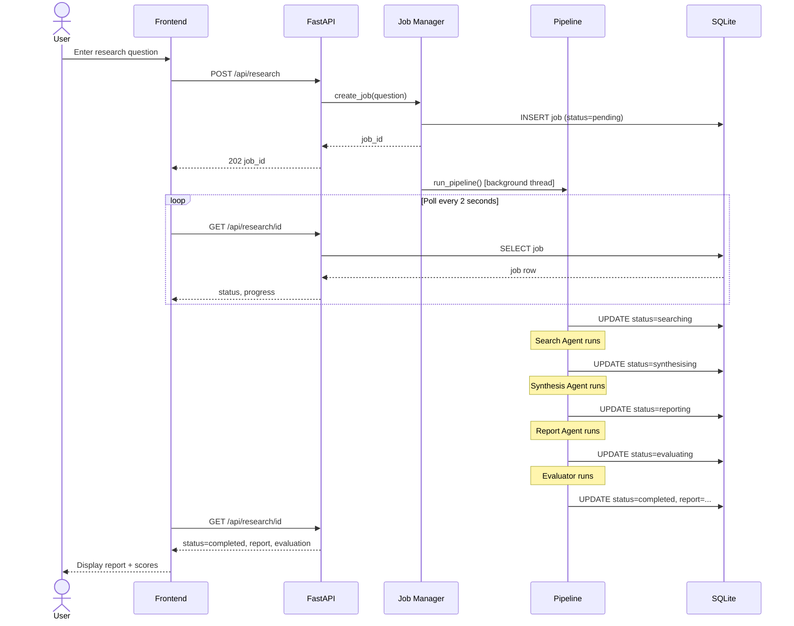

---

## 3. The Multi-Agent Pipeline

Each agent in the pipeline is a stateless function that reads from and writes to a shared `SharedState` object. Agents are called sequentially — each one enriches the state for the next.

### 3.1 SharedState Schema

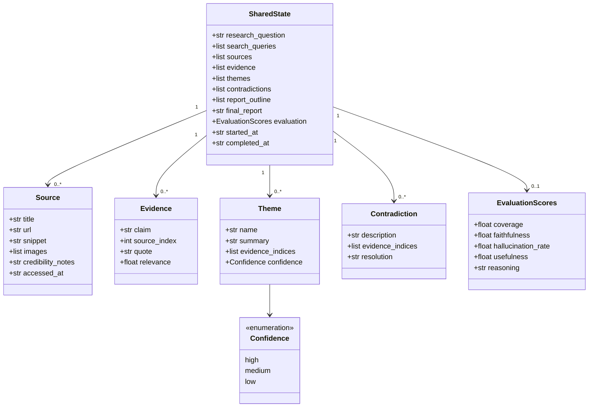

### 3.2 Agent Pipeline Flow

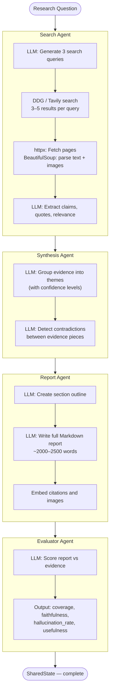

### 3.3 Search Agent Detail

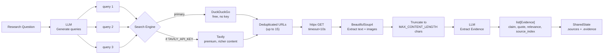

### 3.4 LLM Provider Strategy

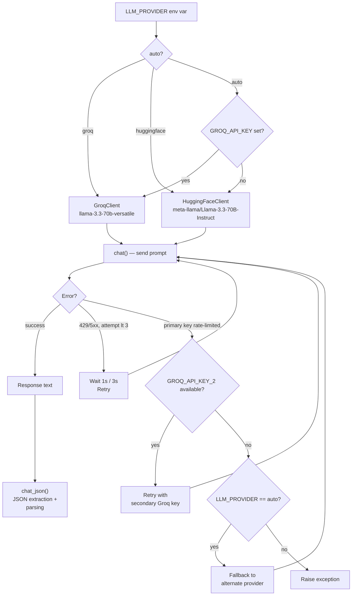

### 3.5 Evaluation Scores

| Dimension | Score |
|-----------|-------|
| Coverage | 0.87 |
| Faithfulness | 0.92 |
| Usefulness | 0.85 |
| Hallucination Rate | 0.08 |

---

## 4. Data Persistence

### 4.1 SQLite Schema

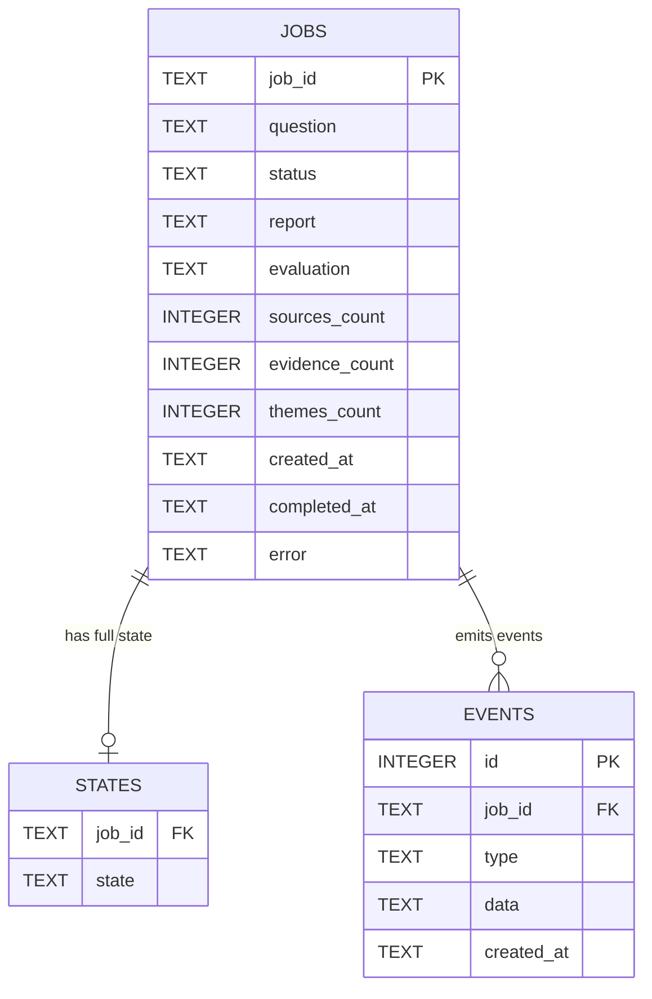

### 4.2 Job Status Lifecycle

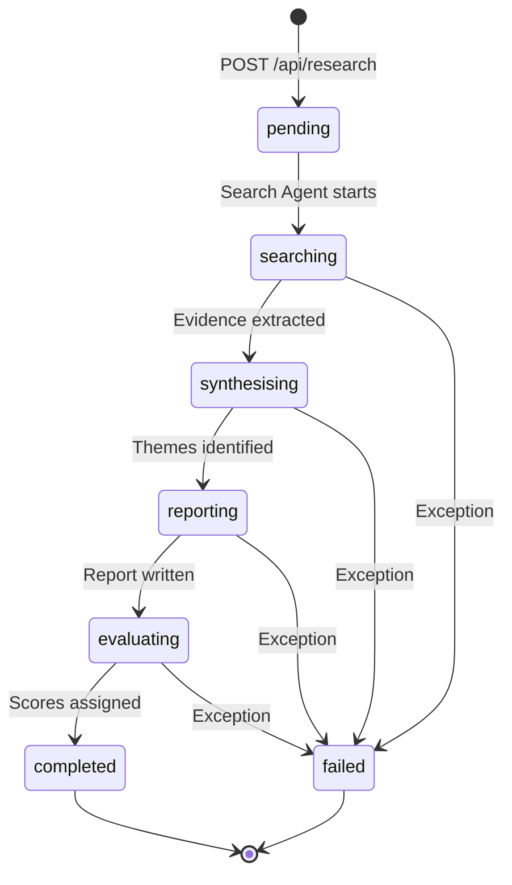

### 4.3 SSE Event Stream

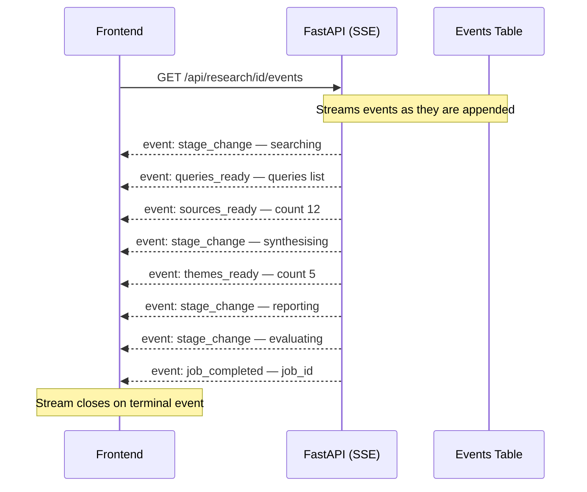

---

## 5. REST API Reference

All endpoints except `/api/health` require the header `X-API-Key: <key>` when `API_KEY` is configured.

| Method | Endpoint | Status | Description |
|--------|----------|--------|-------------|
| `POST` | `/api/research` | 202 | Submit a research question |
| `GET` | `/api/research` | 200 | List all jobs |
| `GET` | `/api/research/{id}` | 200 | Get job status, report, and scores |
| `GET` | `/api/research/{id}/reasoning` | 200 | Detailed reasoning steps |
| `GET` | `/api/research/{id}/events` | 200 | SSE live event stream |
| `GET` | `/api/research/{id}/pdf` | 200 | Download report as styled PDF |
| `DELETE` | `/api/research/{id}` | 200 | Delete a single job |
| `DELETE` | `/api/research` | 200 | Delete all jobs |
| `GET` | `/api/health` | 200 | Health check (no auth) |

---

## 6. Frontend Application

The Next.js 16 frontend (React 19, Tailwind CSS 4, TypeScript) provides three pages.

### 6.1 Page & Component Tree

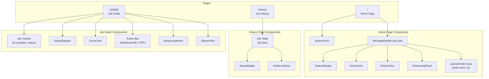

### 6.2 Frontend Data Flow

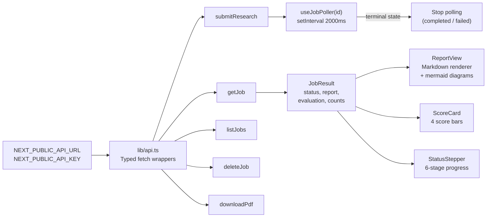

---

## 7. Technology Stack Summary

| Layer | Technology | Version | Role |
|-------|-----------|---------|------|
| Backend language | Python | 3.11+ | All agent and API logic |
| API framework | FastAPI | ≥0.115 | HTTP server, routing, validation |
| ASGI server | Uvicorn | ≥0.30 | Production server |
| LLM (primary) | Groq SDK | ≥0.1 | `llama-3.3-70b-versatile` |
| LLM (fallback) | HuggingFace Hub | ≥0.25 | `Llama-3.3-70B-Instruct` |
| Web search | ddgs | ≥9.0 | DuckDuckGo search (no key) |
| Web search (opt.) | tavily-python | ≥0.5 | Premium search API |
| Web scraping | httpx + bs4 | latest | Page fetching and parsing |
| Data validation | Pydantic | ≥2.0 | Schemas, serialization |
| Database | SQLite | built-in | Persistence, WAL mode |
| PDF generation | WeasyPrint | ≥62.0 | Markdown → styled PDF |
| Markdown | markdown | ≥3.0 | HTML conversion for PDF |
| Config | python-dotenv | ≥1.0 | `.env` loading |
| Frontend | Next.js | 16.2.1 | React 19 App Router |
| Styling | Tailwind CSS | v4 | Utility-first CSS |
| Language (FE) | TypeScript | latest | Type safety |
| Deployment (FE) | Vercel | — | Hosted frontend |

---

## 8. Configuration

Key environment variables (set in `api/.env`):

| Variable | Default | Purpose |
|----------|---------|---------|
| `LLM_PROVIDER` | `auto` | `groq`, `huggingface`, or `auto` |
| `GROQ_API_KEY` | — | Primary Groq API key |
| `GROQ_API_KEY_2` | — | Fallback Groq key |
| `GROQ_MODEL` | `llama-3.3-70b-versatile` | Groq model |
| `HF_TOKEN` | — | HuggingFace token |
| `TEMPERATURE` | `0.3` | LLM sampling temperature |
| `TAVILY_API_KEY` | — | Optional premium search |
| `MAX_SEARCH_QUERIES` | `3` | Queries generated per question |
| `MAX_RESULTS_PER_QUERY` | `5` | Web results fetched per query |
| `MAX_CONTENT_LENGTH` | `3000` | Max characters scraped per page |
| `API_KEY` | — | Auth key (empty = no auth in dev) |
| `DB_PATH` | `data/jobs.db` | SQLite file location |
| `CORS_ORIGINS` | Vercel URL | Allowed frontend origins |

---

## 9. Deployment Architecture

### 9.1 Current vs. Scalable Architecture

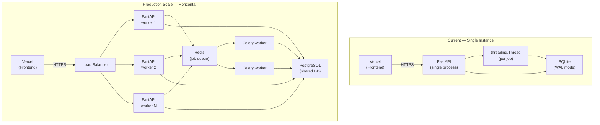

### 9.2 Deployment Checklist

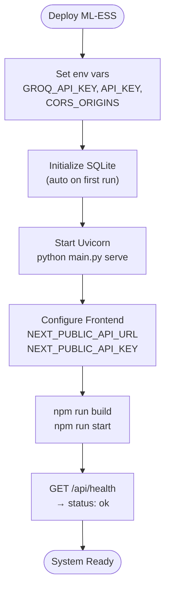

---

## 10. Conclusion

ML-ESS demonstrates how a small, well-structured multi-agent system can automate a complex, knowledge-intensive task end-to-end. By composing four focused agents — each with a clear role — the pipeline transforms a single natural language question into a cited, evaluated research report in minutes. The system is designed for clarity and correctness: low LLM temperature for deterministic outputs, retry/fallback logic for resilience, persistent job state for observability, and a clean typed API for frontend integration.

The modular agent design makes the system straightforward to extend: adding a new research phase (e.g., a fact-checking agent or a translation layer) requires only inserting a new agent function into the pipeline and extending `SharedState` with the new fields.


